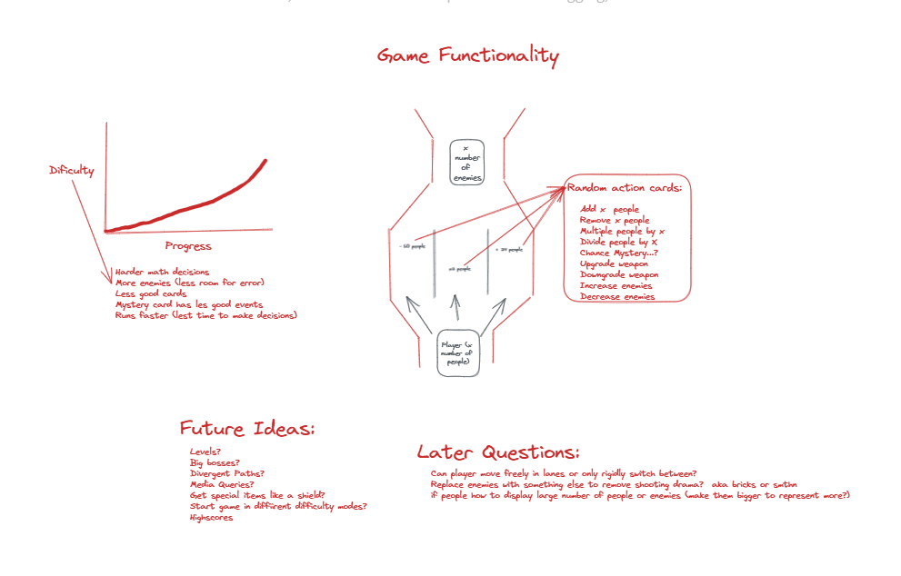

# LavaRun Overview

LavaRun is a simple runner style game. The player controlls a lava creature, and moves him between three lanes to choose different math cards that can increase or decrease his shields. The player then crosses a lava field which decreases his shields. Do the math to figure out how get enough shields to survive the lava!

## Installation

To install LavaRun, clone this repository, and open index.html, it's that easy! LavaRun is also avaible to [play online](https://lavarunn.netlify.app/).

## Gameplay

You can move between three different lanes to choose a lane's "shield". This sheild will either be a positive or negative value or a postive multiplaction that increases, decreases, or multiplies your total shield count respsectively. After choosing a shield, you will have a to cross a lava flow which will decrease your shield count by three.

**Objective:** Collect enough shields to get across the lava without burning to death! <br /><br />
**Movement:** Use the "w" key to move the player up a lane and the "s" key to move the player down a
lane.
**Shields:** You start off with three shields, and can collect up to eleven before you begin the next
shield tier. There are three shield tiers, blue, purple, and gold.

## Code Overview

LavaRun uses the canvas element to display the game. The player and shields are sprites made in Pix2D:


LavaRun is essentially, several class instances moved and rendered with checks to determine game actions. When the play button is clicked, the game initially renders a class instance of the player, shields, shield options, and a lava flow. A game loop is then constantly called as fast as the player's browser can handle until the player runs out of shields while crossing the lava and dies. In the game loop, every class instance but the player is moved and then checks are run to determine events such as if the user has pressed a key to move the player, if the player has selected a shield, or if the player is in the lava. Finally, class instances are rerendered with possible new positinos or values, and a final check is run to see if the game has ended.

**Some of the more complicated parts of index.js (reduced code):**

New shields are rendered every time the player selects a shield and crosses the lava. THe gane design requires there to be at least one "correct" shield that if the player chooses will guarantee him enough shields to make it across the next lava flow. The following code ensures that one of the shields rendered has a math value that if chosen will give the player up to three more shields than needed to cross the lava. What makes it complicated is it's a consecutively derived algorithm, building off every other previous "correct" shield option.

```javascript
let randOrder = Math.floor(Math.random() * 3); //Puts the succesfull path in a random lane
if (i === randOrder) {
  const lowestPossibility = 4 - extraShields; //The lowest number a succesfull path could be is 4 minues any extra shields
  //Get a random number greater than the lowest possible number
  const rndRequired = randomIntFromInterval(
    lowestPossibility,
    lowestPossibility + 3
  );
  if (rndRequired >= 0) {
    operator = "+";
  } else {
    operator = "-";
  }
  result.push(`${operator} ${Math.abs(rndRequired)}`);
  extraShields = extraShields - 3 + rndRequired;
}
```

This is how the player's stats are rendered.

```Javascript
for (let stat in statsArray) {
    const li = document.createElement("li");
    li.setAttribute("class", "endGameStat");
    li.textContent = `${stat.replace("_", " ")}: ${statsArray[stat]}`;
    statsContainer.append(li);
    setTimeout(() => {
      li.style.paddingLeft = "10px";
      li.style.width = "275px";
    }, delay);
    delay += 500;
  }
```

## Tests

Tests if the new class instances of player has numbers for the player's inital x and y positioning.

```javascript
describe("Player Class", function () {
  const test = new Player("", 5, 5);
  it("the x-position rendered should be a number", function () {
    expect(typeof test.x).toBe("number");
  });
  it("the y-position rendered should be a number", function () {
    expect(typeof test.y).toBe("number");
  });
});
```

## Game Design History

**Initial Design**


**Design 2**


## Future Mods

- Add difficulty by widening lava fields as player progresses
- Make negative shields red and positive shields blue
- Make events closer together (rendering two or more of the same events at once on the cavas) so difficutly is the same but speed can be reduced allowing the player to read shield options easier
- Reduce code by creating a sprite class
